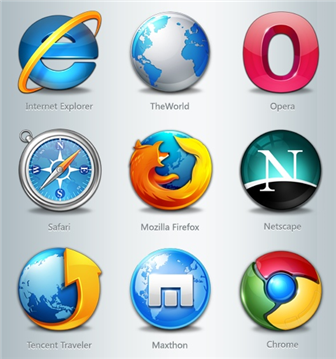
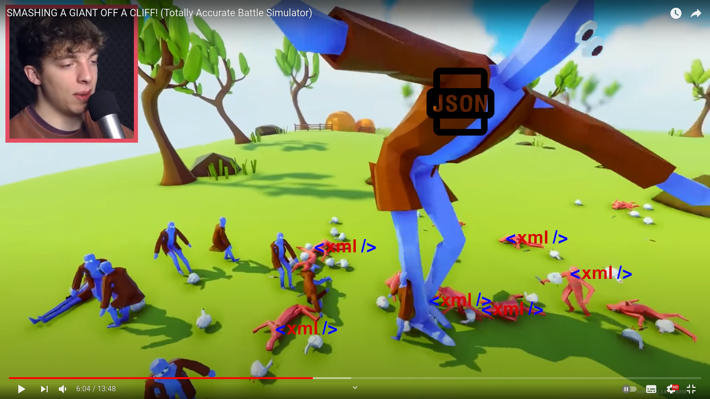

<!--
  $theme: default
  pretender: true
  footer: Matthias Hryniszak - SoftServe 24-06-2021
-->

<!--
  *footer:
-->

# Framework-less frontend development

#### by Matthias Hryniszak

---

A long time ago, in a galaxy not far away...

---

---

---

---

# Tuesday, January 9th, 2018

### The day the world changed

---

---

---

# Tuesday, March 9th, 2021

### The day the world changed - again

---

---

---

# Let's get a bit more technical

---

## The Basics

**HTML**/**DOM** is the representation of concepts
**CSS** determines how they look like and what is their positioning
**JavaScript** makes them behave dynamically

---

# In this instalment... JavaScript

---

## JavaScript is no longer the quirky language!

Classes, properties, private fields, immutable references, closures and arrow functions, async functions, modules, object/array destructuring, shorthand object literals, meta-proramming through prototypes and proxies and more!

A **fully capable**, **dynamic**, **loosely-typed**, **object-oriented**, **functional**, **single-threaded** and **asynchronous** language with **prototypal inheritance** that **rules the world**!

---

# ...and a huge ecosystem!

1,651,401 packages in public NPM registry

---

## A bit of comparison with alien spiecies (Java, .NET, ...)

411,338 projects in Maven Central
244,792 packages in NuGet
173,485 RubyGems
383,596 Go packages
370,940 PyPl packages
38,436 CPAN (Perl)

---

### 1,622,587 combined vs 1,651,401 npm

---

<!-- _color: white -->
## The only language that runs the same runtime everywhere

**...even though Microsoft would like to run .NET apps in the browser too (Silverlight) just like Sun (and now Oracle) also wanted to make their runtime available in the browser (Java Applets)**

---

<!-- _color: white -->
# JavaScript gave birth to JSON

---

# With great power comes great responsibility

---

## With great power comes great responsibility

Learn object-oriented programming and principles and when to use them

---

## With great power comes great responsibility

Learn functional programming and principles and when to use them

---

## With great power comes great responsibility

Learn the APIs (e.g. DOM, `fetch`) instead of reaching for NPM

---

## With great power comes great responsibility

Learn design patterns and SOLID principles

---

## With great power comes great responsibility

Learn refactoring techniques

---

## With great power comes great responsibility

Learn to think like a software programmer - not just web designer

---

# Demo time!

---

# What was that?

The example shows a technique known as modeling the world with objects through inheritance and composition where concepts are represented as instances of classes and put together using composition.

Those are the most important concepts in object-oriented design and development.

---

# Key concepts of object-oriented programming

---

## Encapsulation

*If you don't need it you shall not have access to it. It's mine, not yours to touch*

## Inheritance: is a ...

*A Perfect Headhunter is also a Headhunter*

## Composition: has a ...

*Recruiter has a list of candidates*
*A Company has a list of employees*
*A HiringProcess uses (has a reference to) Headhunter and Company*

---

# Design patterns

A set of rules that when followed lead to a predetermined result.

---

## Design patterns: dependency inversion

Do not depend on implementations but on interfaces.

---

## Design patterns: template method

Extract parts that change from parts that form the core of business transaction.

---

## Design patterns: pub-sub

Disconnect parts of the system so that they don't need to know about each other.

---

# Architecture

---

## Architecture

**Architecture** is not some grand design created by the all-mighty person at the helm. It is the result of work that software developers and business accomplished.

**Architecture** is there to *help* - not obstruct

**Architecture** is not in diagrams and long wiki pages - it is **in the code**

---

## The perfect architecture

*move files around until it feels right* (Dan Abramov)

https://react-file-structure.surge.sh/

---

## The perfect architecture

Environment where things are easy to move forward and implement business needs.

---

# Final thoughts

http://www.testdriven.org

---

# Questions?

---

# May JavaScript be with you! Always!

Blog:
https://padcom13.blogspot.com

LinkedIn:
https://linkedin.com/in/padcom

This presentation:
https://bit.ly/2Q5hE7z
